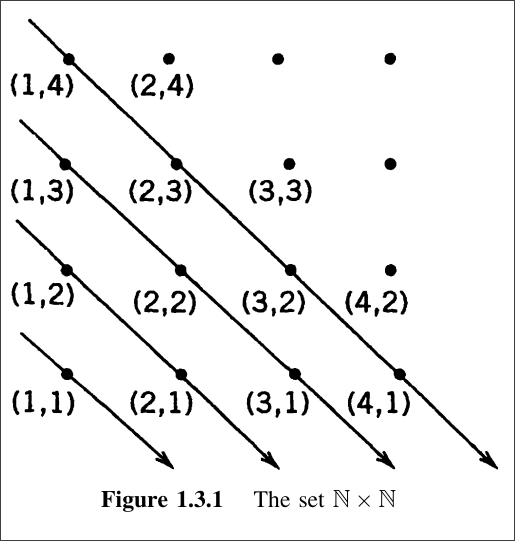

# Chapter 1.3 - Finite and Infinite Sets

> [!thm] Definition (1.3.1): 
> * The $\emptyset$ (empty set) is said to have zero elements.
> * If $n \in \mathbb{N}$, a set $S$ is said to have $n$ **elements** if there exists a bijection from the set $\mathbb{N}_n := \{ 1,2,...,n \}$ onto $S$
> * A set $S$ is said to be **finite** if it is either empty or it has $n \in \mathbb{N}$ elements.
> * A set $S$ is said to be **infinite** if it is not finite.

> [!thm] Uniquness Theorem (1.3.2): 
> *If $S$ is a finite set, then the number of elements in $S$ is a unique number in $\mathbb{N}$*

> [!thm] Theorem (1.3.4) [Principle of Inclusion-Exclusion (Adapted)]:
> * If $A$ is a set with $m$ elements and $B$ is a set with $n$ elements if $A \cap B = \emptyset$, then $A \cup B$ has $m+n$ elements
> * If $A$ is a set with $m \in \mathbb{N}$ elements and $C \subseteq A$ is a singlton set. Then $A-C$ is a set with $m-1$ elements.
> * If $C$ is a infinite set and $B$ is a finite set. Then $C-B$ is an infinite set. 
> ---
> **Form (Without Overlap):** 
>  $$|A \cup B| = |A| + |B| = m + n$$
> **General Form (With/Without Overlap):** 
> $$|A \cup B| = |A| + |B| - |A \cap B|$$

> [!pf] Theorem (1.3.4)
> ***Part (a):***
> - Let $f: \mathbb{N}_m \rightarrow A$ be bijective.
> - Let $g: \mathbb{N}_n \rightarrow B$ be bijective.
>
> Define $h$ on $\mathbb{N}_{m+n}$:
> - Let $h(i) := f(i)$, where $i=1,...,m$
> - Let $h(i) => g(i-m)$, where $i = m+1,...,m+n$
> 
> "*In other words: Define m elements (m:A) to $f$ and the rest (n:g) to $g$*"
> 
> ---
> ***Part (b):***
>
> ---
> ***Part (c):***
>
> ---

> [!thm] Inifintude of Subset Relations (1.3.5)
> Suppose that $S,T$ are sets and that $T \subseteq S$
> - $S$ is a finite set $\implies T$  is a finite set.
> - $T$ is an infinite set $\implies S$ is an infinite set. 

> [!def] Countable Set
> Given a set $A$ and $B \subseteq \mathbb{N}$
> - $A$ is said to be **countable** if there exists a bijection $f: B \rightarrow A$
> - Else it is said to be **uncountable**

> [!def] Denumerable
> If the set is *countable* AND *infinite* it is **denumerable**

> [!thm] The set $\mathbb{N} \times \mathbb{N}$ is denumerable. (1.3.8)

> [!pf] Informal Proof: [The set $\mathbb{N} \times \mathbb{N}$ is denumerable. (1.3.8)]
> Recall that $\mathbb{N} \times \mathbb{N}$ consists of all ordered pairs, $(m,n)$, where $m,n \in \mathbb{N}$.
> Enumerate pairs as:
> $$ (1,1), (1,2), (2,1), (1,3), (2,2), (3,1), (1,4), ... $$
> We can generate this as a diagonal map:
> 
> *Observe the following:*
> - 1st diagonal has one point    [(1,1)]
> - 2nd diagonal has two points   [(1,2), (2,1)]
> - 3rd diagonal has three points [(1,3), (2,2), (3,1)]
> - nth diagonal has n-points
> *We derive the pattern:*
> $$\psi(n) = 1+2+...+n=\frac{n(n+1)}{2}$$
> Where $n$ are the points. and $\psi(n)$ is the number of points the line crosses.
